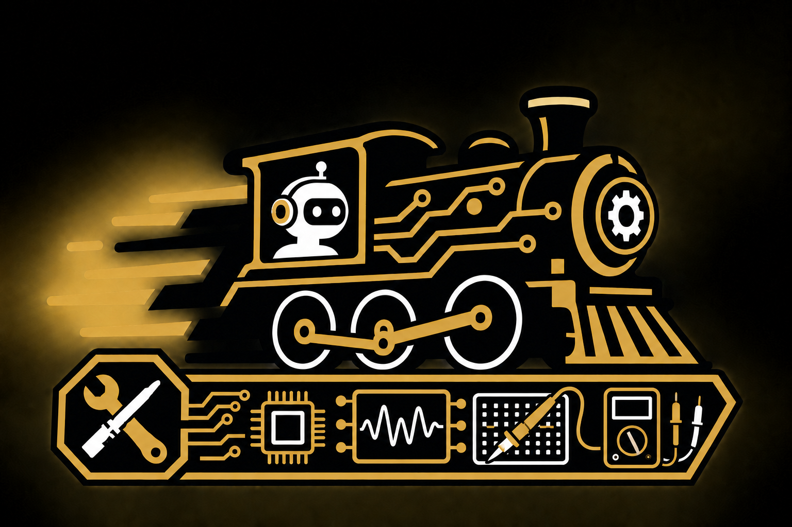

# co_TA

This is the official repository for Purdue University's **co_TA VIP project**.

- [Official VIP project page](https://engineering.purdue.edu/VIP/teams/tagged_items/LabTA_AI)
- [Official project SharePoint](https://purdue0-my.sharepoint.com/personal/shah1030_purdue_edu/_layouts/15/onedrive.aspx?id=%2Fpersonal%2Fshah1030%5Fpurdue%5Fedu%2FDocuments%2FVIP%20AI%20co%2DTA%2FFall%5F26&ga=1)
- [Fall 2026 team](https://purdue0-my.sharepoint.com/:x:/r/personal/shah1030_purdue_edu/_layouts/15/Doc.aspx?sourcedoc=%7BE1F3EC93-80A3-47D2-BEE1-D968933D1EE1%7D&file=Team_Fall_26.xlsx&action=default&mobileredirect=true)

## Goal

Build an AI-powered teaching assistant that gives students accurate, relevant guidance on laboratory concepts, procedures, equipment, and errors—helping them learn without simply giving them the answers.

## Sub-teams

- **Human Interface:** Builds the student-facing UI and interaction loop, collects user data, prepares context for the backend, and presents the AI's guidance.
- **Intelligence:** Develops vector databases, context and prompting strategies, safety guardrails, and evaluations for response quality.
- **Inference:** Deploys and benchmarks AI models while managing the compute, memory, storage, and serving infrastructure.

## Project Roadmap

The initial prototype will support **one laboratory and one student**.

Future goals include:

- **Multimodal support:** Combine students' text descriptions with camera images or video of their circuits.
- **Multi-student scaling:** Support laboratory-scale demand of approximately 1,000 students.
- **Multi-course support:** Make the platform course-agnostic.

## Follow Our Progress

To follow our progress, look at the following:

- [Sub-team progress](Progress_tracker/Subteams/)
- [Weekly meeting notes](Progress_tracker/Weekly%20meetings/)
- [Individual progress](Progress_tracker/Individual/)

## Logistics

- **Weekly meeting:** Wednesday, 2:30–3:20 p.m., BHEE 226
- **Project documentation:** Resources, findings, and experiments belong in the official SharePoint.
- **Communication:** Join the project Discord server as soon as possible.

## Contacts

| Name | Email |
| --- | --- |
| Dr. Vijay Gupta | gupta869@purdue.edu |
| Dr. Milind Kulkarni | milind@purdue.edu |
| Kshitij Shah | shah1030@purdue.edu |
